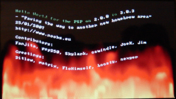

# Goofy Exploit

Proof of Concept homebrew from 2006 and early 2007 which exploited the same _Grand Theft Auto: Liberty City Stories_ save game vulnerability as Cheat Device, because Sony incorrectly had patched this exploit.

Taken from: [PSDevWiki Goofy Exploit](https://www.psdevwiki.com/psp/Vulnerabilities#Grand_Theft_Auto:_Liberty_City_Stories_UMD_(and_the_Goofy_exploit):_PSP_2.00-3.03._Patched_3.30)

> Discovered by Edison Carter, Fanjita and n00bz in 2006.

> There is a stack buffer overflow in the savedata processing of GTA LCS. In essence, the savedata mostly consists of a large structure, with an element indicating the total size. GTA LCS allocates a statically-sized buffer for this to be read into, on the stack - presumably using sizeof(savestruct) or similar. But it copies the number of bytes given by the .size element from the savedata into the stack buffer. By editing the .size element in the saved data, we can therefore force a buffer overflow. The .size element is at offset 0004 in the DATA.BIN file, in the savedata folder. Note that the DATA.BIN is encrypted, so you need to use something like the savedata sample from the pspsdk in order to modify it.

> Sony quickly patched this vulnerability with a firmware update, and released a "new" version of the game that required to install the patched System Software. People wanting to hack their PSP had to be careful not to buy an updated version of the UMD. This is the only time in the PSP history that an exploited game got a UMD update.

> Germany version: 
> - ULES00182 - Unpatched - Contains 2.00 System Software update.

> Europe (UK/EU) version: 
> - ULES00151 first batch - Unpatched - Contains 2.00 System Software update.
> - ULES00151 second batch - Patched - Contains 2.60 System Software update.

> North America (US) version:
> - ULUS10041 - Unpatched - Contains UPDL 0048501A 5, plus IFPI L332 in very small letters on the UMD.
> - ULUS10041 - Patched - Contains UPDL 010050 on the UMD.
> ULUS10041 Unpatched, and Patched UMDs look exactly the same... Only the small codes are different.

> The 18 logo in a red circle is present on the spine on the pre-2.60 UMD, but on the patched 2.60 UMD the 18 red circle logo is not present on the spine.

> Another indication is the copyright date: if it is 2005 then it is unpatched, else it is 2006 and is patched.

> This vulnerability got reused a second time by Noobz on 2007-01-25, in what was called the Goofy exploit, as it was discovered that Sony had incorrectly patched the vulnerability.

## Release Notes
(Taken from: [www.noobz.eu](https://web.archive.org/web/20081212045551/http://www.noobz.eu/joomla/news/sony-goofed-again-hello-world-on-all-v2.0-3.03-firmwares.html))

> You remember that the only thing holding us back from a downgrader for v3.03 was the lack of a user-mode exploit?

> Well, we don't like to be held back from anything, so we went back to basics and looked over some of the old exploits.  And what do you know?  We found one!

> We did a little digging into the old GTA exploit, and discovered that it hadn't been properly patched after all.  We'll leave it as an exercise for the interested reader to figure out exactly how we got past the patch (and to give Sony a little while longer before the head-slapping "Doh!" moment Tongue out).

> But the short version is that we can now run code again via Grand Theft Auto : Liberty City Stories.

> Some details on how to use it:
> - You need an original, unpatched GTA:LCS game.  The new copies that you find in the shops now will not work.
> - This only works for Liberty City Stories, not Vice City Stories.
> - Extract the files from the ZIP into the /PSP/SAVEDATA folder on your memory stick.
> - Start the GTA game, and enjoy the feeling of freshly-minted homebrew :D

> And what of the future?  Well, we should have a 3.03 downgrader ready within the week, using this exploit. 

> Goofy FAQ:

> **Do I need GTA:LCS?**
> Yes, this requires an original unpatched version of GTA:LCS. Once the downgrader is released, you will only need to borrow an unpatched copy of GTA:LCS briefly to perform the downgrade.

> **It didn't work!**
> Verify that you have an unpatched copy of GTA. Only GTA:LCS UMDs that contain a copy of the 2.00 system update will work.

> **It still didn't work!**
> Having other GTA savegames on your memory stick can cause problems. Make a backup of your memory stick contents, reformat the memory stick, and copy only the files from the Goofy ZIP onto it. Restart the PSP and try again.

> **Do we have access to kernel mode?**
> It's a bit tricky, but yes, the kernel mode hole found by Team C+D still works from the Goofy exploit. The downgrader will use this to perform its magic.

> **Should I upgrade to 3.03 in anticipation?**
> The downgrader will require 3.03, but you might want to wait until it comes out before upgrading, just in case!

> **Will the downgrader work on all PSPs?**
> That's the plan.

> **Does this work on custom firmware?**
> If you're already running a custom firmware, congratulations, you have no need for this. But the Hello World should still run if you'd like to see it in action.

## Archival Notes
> [!WARNING]
> As said by the noobz team, this exploit only works for the unpatched versions of _Grand Theft Auto: Liberty City Stories_.