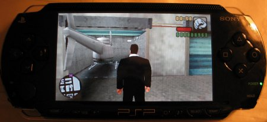
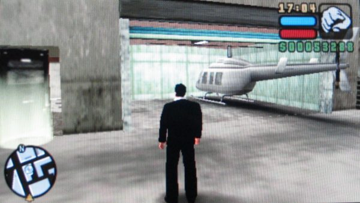

# Helicopter in Garage

Right before releasing Cheat Device, Edison Carter modified an LCS Save Game to spawn an helicopter inside the garage.

## Release Notes
> When GTA:LCS came out, I figured one of the first things to edit would be the save files, but like everything else on the PSP, they're encrypted. I've been working off and on since the game released to try to get into the savefile to edit it, and now a month later I finally got in! I'll be able to do even more with this than I did in San Andreas, but first off, time to edit helicopters into garages.

## Archival Notes
> [!WARNING]
> This savegame probably only works for firmwares below or equal to 2.6 and the unpatched version of _Grand Theft Auto: Liberty City Stories_.