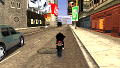

# LCS Cheat Device v0.8

## Release Date
17 jan. 2006?

## Changelog
 - Rocket Boost!
 
## Release Notes
> Rocket Boost gives you forward thrust whether you're on the ground or in the air or upside down. Settings 1 or 2 are good for fast driving on the ground. Rocket Boost 10 is good for making bikes fly.

> I added the ability to turn your motorcycle in the air while using Rocket Boost.

## Archival Notes
 
> [!NOTE]
> This version is unarchived? (See [v0.8a README](../v0.8a/README.md))